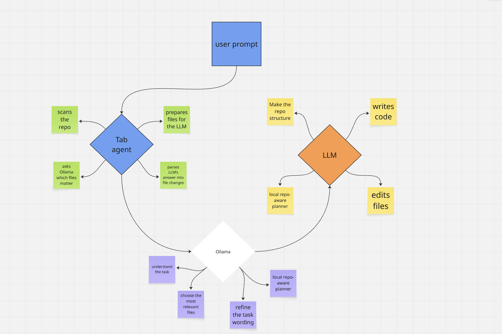

# tab-agent

Monorepo for **Local tab agent**: a VS Code coding assistant that uses **Ollama** locally and **ChatGPT, Gemini, or Claude** in the browser via a Chrome bridge.

### Release 1.0.3 (highlights)

- **Browser file uploads** — Chrome content script uses drag-and-drop (and fallbacks) so attached repo files reliably appear in the AI chat for all supported providers; graceful inline fallback if upload fails.
- **Ollama file picker** — Parses bare JSON array responses from models; repo scan excludes build noise (`obj/`, `bin/`, `.vs/`, and more).
- **Sidebar UX** — First-launch **VS Code notification** plus in-sidebar onboarding for the Chrome extension; Cursor-style chat (inline diff cards, terminal output blocks, task-complete summary, code fences with copy); provider pills (GPT / Gemini / Claude).
- **Chrome bridge** — Manifest aligned to **1.0.3** with clipboard-related permissions used by the webview workflow.

Full extension notes: [`vscode-extension/README.md`](vscode-extension/README.md).

### Workflow

| Part | Folder | Description |
|------|--------|-------------|
| VS Code extension | [`vscode-extension/`](vscode-extension/) | Sidebar agent, Ollama, WebSocket bridge, inline review UI |
| Chrome extension | [`chrome-extension/`](chrome-extension/) | Injects prompts into the AI tab (ChatGPT / Gemini / Claude) and returns replies |

- **Repository:** [github.com/moego0/tab-agent](https://github.com/moego0/tab-agent)

## Quick start

1. **Ollama** — install and run `ollama serve`, pull a coding model.
2. **VS Code extension** — see [`vscode-extension/README.md`](vscode-extension/README.md): `npm install && npm run build`, then F5 or package with `vsce`.
3. **Chrome** — follow **Install Local tab bridge** below, then keep a **ChatGPT, Gemini, or Claude** tab open (match the provider selected in the sidebar).

### Install Local tab bridge (Chrome)

1. Click the **puzzle icon** (Extensions) in the Chrome toolbar → **Manage extensions**.
2. Turn on **Developer mode** (top right), then click **Load unpacked**.
3. Choose the **`chrome-extension`** folder from this repo (the one that contains `manifest.json`) → **Select Folder**.

#### Step 1 — Manage extensions

#### Step 2 — Load unpacked

#### Step 3 — Select the chrome-extension folder

#### Contribution

Contributions are very welcome. The goal of this project is to turn your subscription to any LLM into a coding agent, helping users reduce API costs while still getting powerful AI-assisted development.
It also works without a paid plan; free tiers may limit context depending on the provider.

More detail: [`chrome-extension/README.md`](chrome-extension/README.md).

## License

MIT — see [`vscode-extension/package.json`](vscode-extension/package.json).
